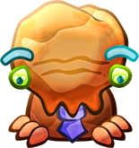

<style>
img  {
  border: solid 3px #ccc;
}
</style>

<div id="text-logo">PeepsQuest</div>

# Creating Sprite Sheets

We were somewhat dismayed that Pixi.js uses a proprietary commercial app to build sprite sheets,
so we built a free solution for our node.js build tool---[Projmate](http://projmate.github.io).
The `pm-spritesheet` filter generates sprite sheets compatible with Texture Packer (as used by pixi.js).

In this tutorial, we'll start with four images




then generate a single sprite sheet containing those images. These are the same images
used by pixi.js in its `Example 2`.


:::BEGIN Example

### Installing Projmate

First install these pre-requisites on your box

*   imagemagick
*   node.js + npm

With those intalled, proceed to installing Projmate globally

    npm install -g projmate-cli@0.1.0-dev

Then inside your project install the sprite sheet filter

    npm install pm-spritesheet


### Creating Task

Here is the example folder layout for the pixi.js example from where the
images above were found

    ▾ tp/
        eggHead.png
        flowerTop.png
        helmlok.png
        skully.png

To create a sprite sheet, create a `Projfile.js` at the root of your
project then add this content. The processing pipeline for `spritesheet`
task is the spritesheet filter.

:::@ --no-capture

```js
exports.project = function(pm) {
  var f = pm.filters(require('pm-spritesheet'));

  return {
    spritesheet: {
      files: 'tp/*.png',
      dev: [
        f.spritesheet({filename: 'SpriteSheet.png', root: 'tp/', jsonStyle:'texturePacker'})
      ]
    }
  };

};
```

To build the spritesheet from a terminal

    pm run spritesheet


<div class='note'>
The generated sprite sheet and JSON meta file is supported by pixi.js. We'll
cover this in a future example.
</div>


Look at this project's `Projfile.coffee` which has the `spritesheet` task for this tutorial.


:::END
